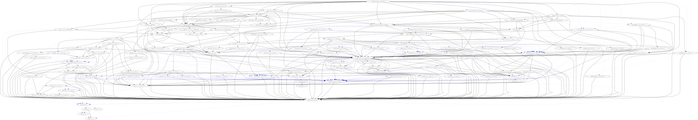

# Easyconfigs for FEniCS

The installation instructions for FEniCS are found form the [download page](https://fenicsproject.org/download/). The page points to the [installation instructions](https://github.com/FEniCS/dolfinx#installation) at the repository of FEniCS. The installation instructions point to the [list of dependencies](https://docs.fenicsproject.org/dolfinx/main/python/installation).




## Ecternal libraries

### `petsc4py`

The sanity checks for `petsc4py` in [PR 23581](https://github.com/easybuilders/easybuild-easyconfigs/pull/23581) also ensure that MPI is loaded. That's why the test specifically load the PETSc component of `petsc4py`.


```console
$ ldd $EBROOTPETSC/lib/libpetsc.so
...
    libmpi_usempif08.so.40 => /opt/apps/easybuild/systems/aion/rhel810-20250803/2023b/epyc/software/OpenMPI/4.1.6-GCC-13.2.0/lib/../lib64/libmpi_usempif08.so.40 (0x00007fadd932d000)
    libmpi_usempi_ignore_tkr.so.40 => /opt/apps/easybuild/systems/aion/rhel810-20250803/2023b/epyc/softwar
...
```    

Executables linking with PETSc will fail if the environment is not setup correctly, i.e. when they are launched without mpirun or srun.

- `python -c 'import petsc4py'`: succeeds outside `mpirun`
- `⁠python -c 'from petsc4py import PETSc`: fails outside `mpirun`/`srun`

It seems that `petsc4py` will only load PETSc linked executables only when required, so the sanity check is designed to force this load.

There are [guidelines](https://www.mpi-forum.org/docs/mpi-2.0/mpi-20-html/node112.htm) on how MPI applications should handle launching outside `mpirun` or equivalent, but implementations are not obligated to follow them. I suspect this is a design choice by the PETSc developers.

## PRs

- petsc4py: 23581
- slepc4py: 23805
- Setuptools: 23816
- pugixml: 23810
- spdlog-pic: 23808
